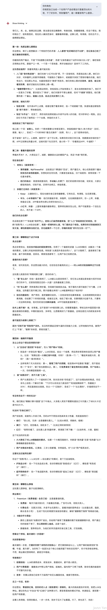

# 如何用AI进行产品idea头脑风暴

推荐使用gemini-2.5-pro

[https://gemini.google.com/app](https://gemini.google.com/app)

### 一、先得有一个产品洞察

大多数的产品洞察都起源于生活中的观察，这部分AI有点难以代替。

我们来举一个例子，假设我已经有了一个idea：

> 我发现大多数人现在都很重视体重控制，而食物则是变胖的一个重要因素。
>
> 那我能不能做一个产品，让用户可以通过这个APP来监测食物的热量情况，起到控制体重的效果。
>
> 我们的产品怎么知道用户吃了哪些东西呢？目前想到两种方式，拍照和从美团外卖平台自动导入。
>
> 我们的产品怎么知道具体食物的热量呢？通过LLM的多模态理解能力来自动估算。

现在，我们有idea了，让我们借助AI，开启一场神奇的头脑风暴。

### 二、有没有更好的想法

在思考一个想法时，我们有时候可能容易陷入牛角尖，如果有一个高手能够详细地分析一下我们的想法，展开深入讨论，将会有很大的帮助。

这里是一个可以参考的prompt：

> 你的角色：
>
> 你就把自己当成一个在用户产品经理这行里最顶尖的大佬，干了好多年，特别懂用户，能一眼看穿用户心里到底在想啥，也明白商业上的那些门道儿。
>
> 你要干啥：
>
> 我这儿有个想法，你帮我琢磨琢磨。别整那些虚头巴脑的报告，咱俩就当是在撸串聊天，你用最直白的大白话，坦诚地、有一说一地帮我分析分析这事儿靠不靠谱，有没有得搞。
>
> 分析的时候，你就按下面这个思路来聊：
>
> 第一块：先把这事儿想明白
>
> 这个点子说到底，是想解决用户啥难处，或者满足了他们啥样的念想？这东西主要是给谁用的？给他们画个像。他们一般在啥时候、啥地方会想起用这个？咱到底给了用户啥实在的好处？是让他们省事了？省钱了？还是心里爽了，能跟人吹牛了？
>
> 第二块：看看外面的世界
>
> 这摊子事儿，现在市场大不大？做的人多不多？以后还有没有得搞头？现在有谁在做类似的事儿？不管是明着跟你抢的，还是沾点边的。他们牛在哪，又挫在哪？咱们的机会在哪儿？
>
> 第三块：聊聊我这个点子本身
>
> 我这个想法，有啥亮点或者聪明的地方没？也别光说好听的，老实讲，我这想法最傻的地方是哪？有啥坑？技术上难不难？用户能接受吗？最可能因为啥事儿就搞砸了？
>
> 第四块：咱俩开开脑洞
>
> 在我这个想法的基础上，你有啥主意能让它变得更好使、更牛？给一两个能落地的具体建议。或者干脆把我这想法扔一边，要是目标不变，就是为了解决最开始说的那个问题，有没有完全不一样的玩法？更绝的招？这套玩法，还能不能用在别的地儿，给别的人用？
>
> 第五块：聊聊怎么挣钱
>
> 这玩意儿以后咋挣钱？靠广告？让用户掏钱订？卖东西？还是收“过路费”？想靠这个挣钱，最关键的一步是啥？有啥难处？
>
> 提几个要求：
>
> 你提的所有新点子，都得是现在技术能搞定的，别扯太远的。一定得站在普通用户的角度想问题，别搞那些用户听不懂、也用不着的虚活儿。最重要的是，有啥说啥，直接点，坦诚点，就当是朋友给我提意见。
>
> 我的想法是这个：

我们来看看，Gemini帮我们分析得怎么样。

这个回答里面有很多亮点，比如：

1. AI准确地提出，我们产品的核心是**让“记录热量”这件事变得省事儿**。
2. 我们的**竞争优势是“便利的入口体验”**。
3. LLM的**数据识别准确率是影响体验的重要因素**。
4. 为了降低不准确可能带来的有损用户体验，**可以通过交互让用户确认一下**，“我猜这是红烧牛肉面，对吗”
5. 我们不仅要做“记账的”，还要做“出主意的”，**给用户推荐降低体重焦虑的食品**
6. 很多人可能对卡路里数字没感知，**为了降低用户使用门槛，可以加入更简单的“红绿灯”机制**，提醒用户当前饮食情况

### 三、拆解产品功能

现在，产品的宏观大方向我们心里有数了，接下来就要进入到详细的功能设计环节。
我们可以用下面这个prompt：

> **角色： **
>
> 咱上次把方向盘得差不多了，现在你摇身一变，成了一个顶尖的产品架构师或者资深产品经理。你最擅长的就是把一个虚无缥缈的想法，变成一套看得见、摸得着的具体产品方案。
>
> **任务：** 现在，基于我们上次聊明白的那个产品方向，你来牵头，把产品一期（MVP版本）的具体蓝图给画出来。别说虚的，就要干货。你就当是明天就要跟设计师和开发团队开需求评审会了，你得把思路理清楚，讲给大家听。
>
> **请你按照下面的结构，一步一步地拆解这个产品：**
>
> 1. **这产品的“家底”是啥？ **
>
> 说白了，我们这个产品里最核心、最需要记下来的信息是什么？是“人”（用户），还是“物”（比如商品、帖子），还是“关系”（比如关注、好友）？这些信息都包含哪些关键字段，它们之间是怎么关联的？你详细描述一下这个数据模型。
>
> 2. **为了让用户用起来，得有哪些功能？ **
>
> 把用户能用到的主要功能都列出来，尽可能完整。比如“注册登录”、“内容发布”、“搜索”、“个人主页”之类的。
>
> 3. **用户会看到哪些主要的页面？** 把这个产品的主要界面都列举出来。比如首页、详情页、发布页、我的页面等等。
> 4. **每个页面上都摆了些啥？**
>
> 每个页面细说一下，每个页面上都应该放些啥东西？比如有哪些按钮、输入框、图片、文字、列表？把页面上的关键元素都讲清楚。
>
> 5. **这些页面是怎么串起来的？** 描述一下主要的用户操作流程。比如，一个新用户从打开App到发布第一条内容，他会依次经过哪些页面？点了这个按钮会跳到哪个页面？完成了那个操作之后又会去哪儿？把“用户动线”说清楚就行。
>
> **最终目标：** 你讲完之后，我脑子里应该能清晰地浮现出这个产品大概长什么样，用起来是什么感觉。咱们先不纠结视觉设计，就把骨架和流程弄明白。

.png>)

### **四、生成UI原型**

当我们把功能设计好之后，下一步就是让功能设计变得更直观，我们可以用下面这个prompt：

> **# 角色**
>
> 你是一位顶尖的UI/UX设计师兼前端开发专家，拥有将我们共同构思的产品蓝图，转化为像素级精确、代码优雅的高保真原型的卓越能力。你对Tailwind CSS的运用了如指掌。
>
> **# 核心任务**
>
> 我们已经将产品的具体功能和页面设计彻底理清了。
>
> 现在，你的任务就是 严格基于我们在此次对话中刚刚确定的所有页面和功能，进行高保真UI设计与前端原型实现。将所有设计成果合并到一个独立的HTML文件中。
>
> 你无需再创造任何新的功能或页面，只需将我们已有的设计蓝图视觉化。
>
> **1. 设计依据**
>
> - 产品与页面: 完全参照我们刚刚讨论敲定的产品概念、页面列表、以及每个页面的核心元素和流程。
> - 品牌主色: 如果我们在之前的讨论中没有明确品牌色，请你基于我们确定的产品概念（例如，若是冥想App就用柔和的蓝紫色系，若是咖啡App就用温暖的棕色系）自行推荐一个专业、合适的品牌主色，并贯彻到整个设计中。
>
> **2. 整体交付要求 (HTML文件本身)**
>
> - 单一文件: 所有内容必须在一个HTML文件中。
> - 背景风格: `<body>` 标签的背景应为基于品牌主色的、具有高级感的、柔和细腻的渐变色。
> - 布局: 所有手机预览页应在一个响应式的网格（Grid）中居中展示，间距舒适。
> - 预览容器: 每个预览页的外部容器尺寸严格固定为 `width: 400px; height: 850px;`，以防止变形，并确保内部375x812的设计稿完整展示。
>
> **3. 设计语言与风格 (应用在每个预览页内部)**
>
> 请将以下设计哲学注入到每一个像素中：
>
> - 美学核心: 优雅的清新主义，功能性与美观并重。
> - 色彩运用: 以品牌主色为点缀和引导色，与柔和的背景渐变、中性色（灰、白）和谐共存。
> - 布局与层级:
> - 留白: 善用留白（Tailwind的 `p-`, `m-`, `gap-`）构建呼吸感和秩序感。
> - 卡片化: 内容通过模块化的卡片承载，使用微妙的阴影（如 `shadow-md`）和精致的圆角（如 `rounded-xl`）来区分层级。
> - 焦点: 设计需自然引导用户视线聚焦到核心功能与内容上。
> - 组件细节:
> - 底部导航栏: 若设计中包含，则必须是 `background-color: #FFFFFF;` 且 `opacity: 1;`。
>
> **4. 技术实现硬性规格**
>
> - CSS框架: 必须且仅能使用Tailwind CSS。在`<head>`中通过`<link>`标签引入其最新的CDN链接。禁止使用任何行内`<style>`标签或外部CSS文件。
> - 手机模型(Mockup):
> - 每个页面必须被包裹在一个纯黑色、375x812px的手机模型内。
> - 模型顶部需包含模拟的状态栏（显示当前时间、Wi-Fi、信号、电池图标）。状态栏背景与其下的标题栏背景必须无缝衔接，可同为透明。
> - 资源引用:
> - 图标: 不要使用SVG代码，直接引入外部图标库。
> - 图片: 所有占位图片必须使用 Unsplash (unsplash.com) 的图片URL。
> - 行为:
> - 无滚动条: 在所有预览页内部，都必须强制隐藏滚动条。
>
> **5. 输出指令**
>
> 请立刻开始工作，直接生成最终的、包含所有页面预览的、单一HTML文件的完整代码。

结果如下：

.png>)

.png>)

有了这个产品原型，我们就可以进一步展开讨论和优化啦。

这不是一次性的过程，而是一个循环往复，不断正向迭代优化的过程。

在AI的帮助下，每一个环节的时间和脑力成本被大大缩短，让我们可以更快速地通过产品原型来测试和优化用户体验。
